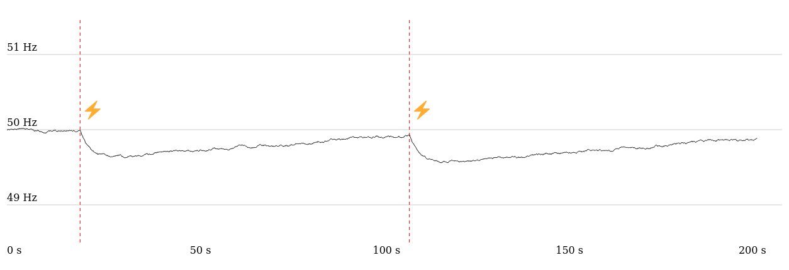

# SSY - Frequency

Simple simulation of the frequency behavior of a grid-scale electrical network. It is built for _teaching purposes_ and thus takes some clear liberty on how some things are simulated versus how they behave in practice.

The simulation shows how a grid-scale electrical behaves in case of a power outage (loss of part of its generation capacity) and the various automatic ways used to restore the frequency to its nominal value: **FCR** (Frequency Containment Reserve) and **FRR** (Frequency Restoration Reserve).

The simulation only shows _automatic_ ways to restore the frequency for simplicity sake. In practice, there are complementary manual ways to restore the frequency: the balancing market and direct manual intervention from TSOs and/or DSOs.

For more information the following links can be useful :

- RTE, Fournir des services système fréquence, https://www.services-rte.com/fr/decouvrez-nos-offres-de-services/fournir-des-services-systeme-frequence.html
- Gauthier Marc Aimé Delille. Contribution du Stockage à la Gestion Avancée des Systèmes Électriques : approches Organisationnelles et Technico-économiques dans les Réseaux de Distribution. Autre. Ecole Centrale de Lille, 2010. Français. [⟨NNT : 2010ECLI0016⟩](https://www.theses.fr/2010ECLI0016). ⟨tel-00586088⟩
